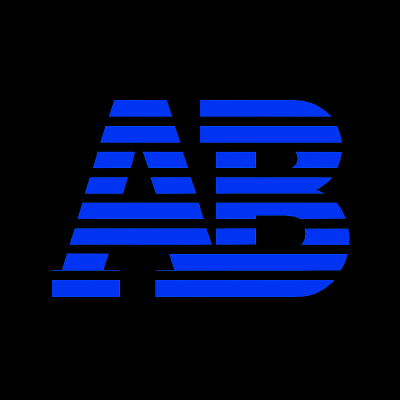

<!-- logo :) -->

# 🐍 Aprendizado Documentado - Minha Jornada Python

## 📖 Sobre Este Repositório

Olá! Eu sou **Antonio** e este repositório é meu **diário de bordo digital** 
enquanto aprendo Python de forma quase autodidata.

Já tive contato com programação no curso técnico e aprendi algumas coisinhas, 
mas agora quero me aprofundar na área e escolhi a linguagem Python 
porque a considero muito promissora.

Aqui não há códigos perfeitos copiados de tutoriais. 
Aqui há **tentativas, erros e descobertas.** 
Cada pasta e arquivo conta uma parte da minha jornada de aprendizado, 
incluindo meus comentários e pensamentos no momento em que escrevi cada código.

---
## 🎯 Meu Objetivo

Transformar minha curiosidade em código, minha persistência em habilidades, e minha jornada em uma carreira como desenvolvedor.

---
## 📂 Navegação no Repositório

### 🗺️ Rota de Aprendizado até agora
1. **Fundamentos Sólidos** - Sintaxe, estruturas de dados, funções

---
